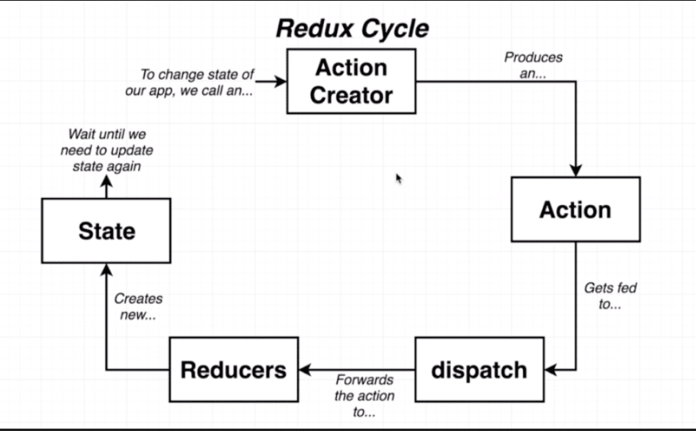
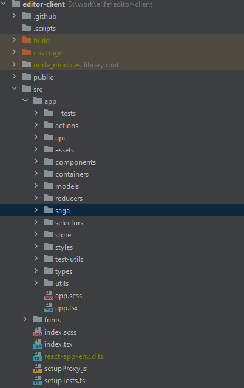

# Editor Client 

This document describes the internal structure and architecture of the Editor Client application.

## React and redux ecosystem

The app is built using React on the presentation layer. Every part of the application view is a React component. With only a couple of exceptions, functional components were used across the application. State management is provided by Redux.

### Redux



On the diagram above the state change cycle is displayed. The view layer of the application always reflects the application state. When a user makes changes to the article, an **action** is created using the **action creator** (action creators can be found under `src/app/actions/`). An action is then dispatched to Redux state manager and is handled by the reducer. Essentially action handlers, reducers are functions that change the application state. Each reducer produces a new application state. When the application state is changed, react will intend to update the view accordingly. More about this process can be found on the [official redux website](https://redux.js.org/tutorials/essentials/part-1-overview-concepts).

### Redux Saga

Side-effects are used for handling actions that require code to reach outside the Redux cycle. To handle side-effects redux-saga is used. Redux saga uses generators to handle streams of actions. Generators were first introduced in ES6 and are well documented. More info on generators is available from [here](https://davidwalsh.name/es6-generators) and on redux-saga from their [official documentation](https://redux-saga.js.org/docs/introduction/GettingStarted).

## File Structure

Project directory structure is built as follows



- `actions` - contains all action creators definitions

- `api` - contains functions to make calls to the server API

- `assets` - contains icons and SvgIcon wrappers for future use in material ui components

- `components` - contains React components that are not directly related to any of the Editor Client screens and are intended to be reused multiple times. Components do not integrate with Redux directly.

- `containers` - are React components that implement parts of functionality and represent screens or modal dialogs (often referred to by the designers as cards)

- `models` - contains functions to create manuscript sections from XML

- `reducers` - reducers functions to handle state changes. To minimise boilerplate redux-act is used

- `saga` - functions that handle side-effects of actions. Those include formatting of text using hot keys or top toolbar and menus, handling route change, saving user changes and table of contents navigation.

- `selectors` - contains all functions for accessing application state from saga or from containers. Selectors are using reselect library.

- `store` - contains functionality to initialise Redux store.

- `styles` - contains reusable styles and material ui theme configuration.

- `test-utils` - contains helper functions for unit testing.

- `types` - contains type definitions for various parts of the application
utils - contains helper functions for various parts of the application.

## Manuscript State

`ManuscriptState` section of the application state represents the article currently loaded and consists of the following parts

- Journal meta
- Title
- Article information
- Authors
- Affiliations
- Abstract
- Impact statement
- Body
- Acknowledgements
- Keyword groups
- References
- Related articles

All of the above represent a corresponding section of the XML and a section of the manuscript container. The type definition for this can be found in `src/app/type/manuscript.ts`

## Modals

Editor Client uses modals for editing article backmatter, such as authors affiliations, etc. Each of the modal forms is declared in the corresponding folder with name ending in `-Dialog`. In cases when a dialog form can be reused by another dialog, e.g. adding a new affiliation from inside Editor Author dialog, the affiliation dialog was separated into two. A form component called `AffiliationFormDialog` and a container called `ConnectedAffiliationFormDialog`. In terms defined earlier the former is a reusable component while the latter is a container that can dispatch actions.

Modal displaying mechanism is a part of the application state. `showModalDialog` action is used to open a connected dialog. The actions payload accepts the component class that will render the dialog content, props that will be passed to the component and a title for the dialog box.
```
dispatch(
 manuscriptEditorActions.showModalDialog({
   component: AuthorFormDialog,
   title: 'Add Author'
 })
);
```

Component should dispatch `hideModalDialog` action to close the dialog.

To render a dialog not connected to the state a `ModalContainer` is used.

In the example given below `Affiliation` form will be rendered in a dialog box.
The props object must contain callbacks for corresponding events to communicate with the affiliation form component.

```
<ModalContainer
 title={props.affiliation ? 'Edit Affiliation' : 'Add Affiliation'}
 params={props}
 component={AffiliationFormDialog}
/>
```

Editor Client utilises confirmation dialogs for deletion operations.
A component called `PromptDialog` was created for this purpose. It can be found in `src/app/components/prompt-dialog/index.tsx`

## Manuscript Container

Main screen of the application is rendered by `ManuscriptContainer` that uses three child components `ManuscriptTOC`, `ManuscriptToolbar` and `ManuscriptEditor`.

`ManuscriptEditor` contains all editor components for manuscript sections such as title, abstract, body, keywords, etc.

## Prosemirror

[Prosemirror](https://prosemirror.net/) is an open-source library which impliments a WYSIWYG-style editing interface for documents more constrained and structured than plain HTML. 

Along with offering a rich-text editing interface, Prosemirror also offers pre-designed data models for handling and serializing editor states and changes as well as a [plugins](https://prosemirror.net/docs/ref/version/0.12.0.html#state.Plugin_System) system to extend the editors functionality.

### RichTextEditor

To make integration into React infrastructure simple, Prosemirrors `EditorView` is wrapped into a react component, `RichTextEditor`. 

The `RichTextEditor` component declared in `src/app/components/rich-text-editor/index.tsx` is a class based component. Using a class component in this case allows for better structure of the code and finer control of the lifecycle events. One important thing to know about this component is that it is stateful.

[`EditorState`](https://prosemirror.net/docs/ref/#state.Editor_State) object that represents a value for the prosemirror editor is kept in the state and used to prevent unnecessary re-rendering of this component. A very similar `EditorState` object will be stored in the application. When the application state changes and an updated `EditorState` makes its way onto the properties of `RichTextEditor`, it will first compare documents to make sure they are different. If a difference is detected, then the application state takes precedence.

### Node Views

By default, all nodes in Prosemirror are rendered as text nodes. Prosemirror supports custom node rendering and editing using [`NodeView`](https://prosemirror.net/docs/ref/#view.NodeView). To specify a custom node renderer, set a `nodeView` property to a function which returns an `NodeView` object implimentation. Each property key should match a node name in Schema and values should be functions that return an object implementing the `NodeView` interface. In essence a custom node editor is a class that renders an `EditorView` inside `EditorView`. To make creating custom node editors easier an abstract class `NodeEditor` is introduced. This class doesn’t implement `NodeView` interface, instead it provides a mechanism to create an `NodeView` from a given node. The `render` method is not implemented within `NodeView`, it should be implemented in the concrete implementations. 

`NodeEditor` requires a context to operate. The information available from the context is defined by NodeViewContext interface

```
interface NodeViewContext {
 view: EditorView;
 getNode: () => ProsemirrorNode;
 getPos: () => number;
}
```
 
`NodeEditor` doesn’t provide any callbacks to indicate a change has occurred. Instead all changes made are dispatched to the parent view immediately. To do this correctly `NodeEditor` uses two offset values provided by context `getPos` function and the offset property provided. The first always provides the position of the node edited in the document. The second is the start of the content of the node edited relative to the value returned by `getPos`.

It's worth noting that this value should never be zero. To illustrate this case let’s look at the following example:

```
<document>$1Sample text $2<figure>$3<title>$4Title text</title></figure></document>
```

Assume the following structure parsed by Prosemirror and a custom `NodeView` being attached to `<figure>`. In Prosemirror, position of a node is identified as a numerical offset from the start of the document. $1 will always equal 0 being the start of the content of the document. $2 will mark position 12. The example is given without formatting because spaces are important to Prosemirror. When `NodeView` is created `getPos` will return 12 since that is the position of the node being edited. If content before the node changes the value returned will change to reflect that. Now let’s assume we are creating a `NodeEditor` for `<title>` node. We need to specify the correct offset. If we try to find the offset of title node we will end up with position $3 which is the first position of the content and equals 13. The content of the edited node always starts with `getPos() + 1` however `NodeEditor` needs to know the start of the content it is editing. Hence we need to provide position $4 which in our example equals 14. 

Let's now look at the implementation of `FigureEditor` component which combines all child nodes of a figure. For editing title, legend and attribution a `FigureContentEditorComponent` component was created. It defines a render method where protected methods of  `NodeEditor` are routed into `RichTextEditor`. 
The following extract of FigureEditor shows how this component works. It receives a node which content needs to be edited and an offset of the content. Function `findChildrenByType` recursively goes through all children of the figure node. Due to the specifics of prosemirror implementation the offset returned is relative to the figure node and not its content. If we refer back to the previous example, position $4 will be found as 2 because descendants call starts with position $2 and treats that as 0. Hence `FIGURE_TITLE_CONTENT_OFFSET_CORRECTION` is set to 2.

```
<FigureContentEditor
 label="Title"
 node={titleNodeData.node}
 offset={titleNodeData.offset +
FIGURE_TITLE_CONTENT_OFFSET_CORRECTION}
/>
```

`FigureEditor` component also renders an image and a text input. Those changes are propagated back via an event callback `onAttributesChange`. This is then handled by the `FigureNodeView`. The implementation of the class becomes more simple when using `NodeEditor` since those take on all the boilerplate of handling offsets and dispatching changes.

```
<NodeViewContext.Provider
 value={{
   view: this.view,
   getPos: this.getPos,
   getNode: () => this.node
 }}
>
	// node view code goes here
</NodeViewContext.Provider>
```

More on prosemirror node views can be found [in the examples](https://prosemirror.net/examples/footnote/) and in the [official documentation](https://prosemirror.net/docs/ref/#view.NodeView).  

## Changes

Any change made in Editor Client is represented by an object that extends base class [`Change`](../src/app/utils/history/change.ts). This approach is an implementation of a [Command pattern](https://en.wikipedia.org/wiki/Command_pattern).

```
export abstract class Change {
  abstract applyChange(manuscript: Manuscript): Manuscript;
  abstract rollbackChange(manuscript: Manuscript): Manuscript;
  abstract isPathAffected(pathPattern: RegExp): boolean;
  abstract get isEmpty(): boolean;
  abstract toJSON(): JSONObject;

  protected _timestamp: number;
  constructor() {
    this._timestamp = Date.now();
  }

  get timestamp(): number {
    return this._timestamp;
  }
}
```
Each change when applied produces a new [`Manuscript`](../src/app/types/manuscript.ts) object, changing values of one or more of its parts. There are several types of changes that can be made to a manuscript.

### ProsemirrorChange

[ProsemirrorChange](../src/app/utils/history/prosemirror-change.ts) is created from a prosemirror transaction. This change can be applied to an `EditorState` section of the `Manuscript`. Following example from the [`updateManuscriptState`](../src/app/utils/history.utils.ts) function demonstrates how a prosemirror change is applied to a `Manuscript` and how a new `Manuscript` state and history are created.

```
const change = new ProsemirrorChange(propName, transaction);

if (transaction.docChanged) {
 return {
   past: [...state.past, change],
   present: change.applyChange(state.present),
   future: []
 } as ManuscriptHistory;
} else {
 return {
   ...state,
   present: change.applyChange(state.present)
 };
}
```

To rollback a change (something which happens when the user clicks the undo button on the toolbar), the transaction steps of the transaction are reversed and remapped. Internally, a new transaction is created which reverts the original change and a new `Manuscript` with this transaction applied is returned.

**The `ProsemirrorChange` object is mutable.** When a transaction is deserialized from steps it is impossible to convert steps to a transaction because the transaction is tied to the `EditorState` which creates this transaction. If we try to deserialize a chain of related prosemirror changes and create transactions when deserializing, we won’t be able to apply those changes sequentially. All of them will only be applicable to the original `EditorState`. Once we apply the first change, the state which originated all other transactions will not exist. Hence if a `ProsemirrorChange` is deserialized the transaction will not be created until we try to apply this change.

### AddObjectChange

[AddObjectChange](../src/app/utils/history/add-object-change.ts) is a change that adds an element to a list. This change is used for adding [`BackmatterEntities`](../src/app/models/backmatter-entity.ts), e.g. [authors](../src/app/models/person.ts), [affiliations](../src/app/models/affiliation.ts), [references](../src/app/models/reference.ts), [related articles](../src/app/models/related-article.ts), etc. 


**The `AddObjectChange` is immutable.** This change receives an object to be added. When the change is applied the new entity is added to the end of the list. When the change is rolled back, entity id is used to identify the object to remove.

### DeleteObjectChange

The [`DeleteObjectChange`](../src/app/utils/history/delete-object-change.ts) is a change that removes an element from a list. This change is used for removing [`BackmatterEntities`](../src/app/models/backmatter-entity.ts), e.g. [authors](../src/app/models/person.ts), [affiliations](../src/app/models/affiliation.ts), [references](../src/app/models/reference.ts), [related articles](../src/app/models/related-article.ts), etc. 

**The `DeleteObjectChange` is mutable.** This change receives an object to be removed. When the change is applied an index of the object in the collection is identified. This index is then used to revert the change by reinserting the object back into the collection.

### RearrangingChange 

The [`RearrangingChange`](../src/app/utils/history/rearranging-change.ts) is a change that alters the order of elements in a list. This change is used to rearrange authors' order, sort references, and update affiliations’ order when authors are rearranged. There are two ways to create this change.

```
public static createFromItemMoved<T>(
 path: string,
 oldIndex: number,
 newIndex: number,
 collection: Array<T>
): RearrangingChange
```

One receives two indexes and will move only one item. In this case an item will be moved from `oldIndex` to  `newIndex`. This method also requires the original collection for which an operation is performed.

The other method takes two collections.
 
 ```
createFromListRearrange<T>(path: string, oldOrder: Array<T>, newOrder: Array<T>): RearrangingChange
```

The method then identifies how the order of items has changed. This method can support multiple rearrangements. 

**The `RearrangingChange` is immutable.** When the change is applied the original list is remapped according to the new order of indices identified when change is created.

### UpdateObjectChange 

The [`UpdateObjectChange`](../src/app/utils/history/update-object-change.ts) is a change that alters plain objects of the manuscript. This change is used for editing [`BackmatterEntities`](../src/app/models/backmatter-entity.ts), e.g. [authors](../src/app/models/person.ts), [affiliations](../src/app/models/affiliation.ts), [references](../src/app/models/reference.ts), [related articles](../src/app/models/related-article.ts), etc. This change **cannot** be created explicitly. The factory method `createFromTwoObjects` always returns a `BatchChange` and one of the changes in a batch can be `UpdateObjectChange`. 

We return a `BatchChange` to account for any `EditorState` properties which may live inside of the `BackmatterEntity` object eg: an [author](../src/app/models/person.ts) entity has a `bio` property which is an `EditorState` but also has primative values such as `givenName` and `emial`. The primative value diffs can be handled by `UpdateObjectChange` but any changes to `bio` should be a `ProsemirrorChange` object.

The signature for the factory function `createFromTwoObjects` is:

```
public static createFromTwoObjects<T>(path: string, oldObject: T, newObject: T): Change
```

This method receives two objects and identifies differences between them using a library called `deep-diff`., ignoring the `EditorState` values, it then creates a `BatchChange` with an `UpdateObjectChange` for the changed primative property values detected and `ProsemirrorChange`s for any `EditorState` values changes.

**The `UpdateObjectChange` change is immutable.** The change uses the library functions to apply and revert the object diff.

### BatchChange 

The [`BatchChange`](../src/app/utils/history/batch-change.ts) is used to combine sequences of simple changes. This change receives a list of changes when created. One batch change can combine multiple other batches of changes creating complex orders of changes.

**The `BatchChange` is immutable.** The changes are applied one by one to the manuscript object. When changes are rolled back a reverse order is used.
